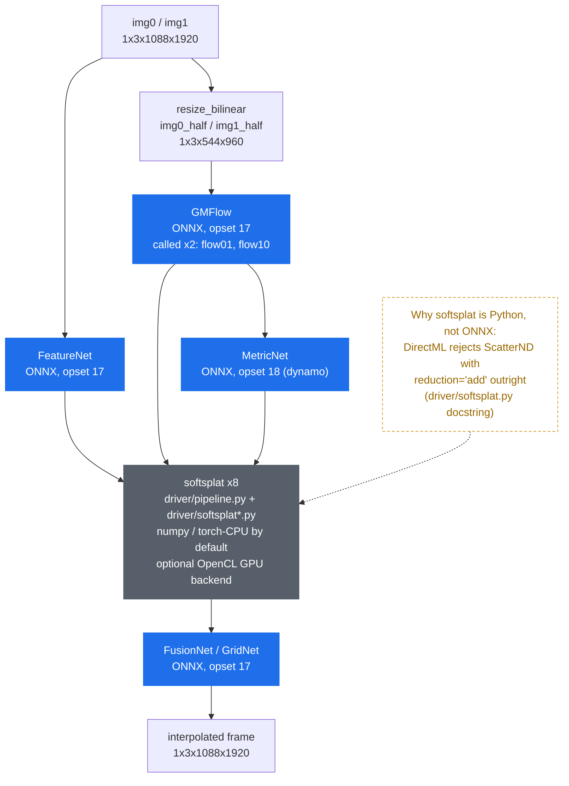

# port-gmfss-onnx

**First known ONNX port of [GMFSS_Fortuna](https://github.com/98mxr/GMFSS_Fortuna) — one of the best anime frame-interpolation models — running on *any* DirectX 12 GPU (AMD, Intel, NVIDIA), no CUDA required.**

[](LICENSE)
[](artifacts/manifest.json)
[](https://onnxruntime.ai/docs/execution-providers/DirectML-ExecutionProvider.html)
[](toolkit/setup-env.ps1)

## Why this exists

[GMFSS_Fortuna](https://github.com/98mxr/GMFSS_Fortuna) is one of the strongest open models for anime/animation frame interpolation, combining optical flow (GMFlow) with a synthesis network tuned for hand-drawn and cel-shaded motion. It is MIT-licensed.

Like most PyTorch research models, it only runs well with **CUDA**. Anyone on an AMD or Intel GPU is stuck on CPU inference, which is impractical for video work, or has no path to run it at all inside a lightweight, torch-free application.

**This project decomposes GMFSS_Fortuna into plain ONNX graphs** so the heavy compute runs through [onnxruntime](https://onnxruntime.ai/) on **any execution provider** — DirectML (any DX12 GPU: AMD Radeon, Intel Arc, NVIDIA), CUDA, or CPU. No torch at inference time, no CUDA lock-in.

Numbers will be added here as each phase lands — measured on real hardware, never promised in advance.

## How it works

GMFSS_Fortuna interpolates a frame between two source frames (`img0`, `img1`) at one or more
timesteps `t ∈ (0, 1)`. This port keeps the exact same computation, but splits it across two
layers: 4 ONNX graphs for everything that maps cleanly onto onnxruntime ops, and a small Python
driver for the one operation that doesn't.



**Pipeline** (`driver/pipeline.py`'s `GmfssDriver`, mirrors `toolkit/gmfss_pg_pipeline.py`'s
reference composition — FeatureNet → GMFlow×2 → MetricNet → softsplat×8 → FusionNet):

1. **FeatureNet** — run once per source image, produces a 3-level feature pyramid (scale1/2/3
   = half/quarter/eighth of the padded resolution).
2. **GMFlow** — one graph, called *twice* per pair with swapped inputs to get `flow01` and
   `flow10` (bidirectional optical flow between the half-resolution images).
3. **MetricNet** — run once per pair, consumes both flows, produces `metric0`/`metric1`
   (per-pixel log-weights that resolve occlusion during splatting).
4. **softsplat × 8** — forward-warps `img0_half`/`img1_half` and all 6 pyramid feature maps
   toward timestep `t`, softmax-weighted by the metric. Runs in `driver/softsplat.py`
   (numpy + torch-CPU) by default, or `driver/softsplat_cl.py` (hand-written OpenCL kernel) if
   opted in — see [OpenCL splat kernel (Task 3.1)](#opencl-splat-kernel-task-31) above.
5. **FusionNet (GridNet)** — run once per timestep, takes the splatted RGB + feature maps and
   produces the final interpolated frame.

**Why softsplat lives outside the ONNX graph**: it is the one operation in the whole pipeline
that doesn't survive the trip to DirectML. As `driver/softsplat.py`'s own docstring puts it:
*"DirectML rejects ScatterND with reduction="add" outright, which is why this needs a portable
driver at all instead of running on DML."* Every other op in FeatureNet/GMFlow/MetricNet/
FusionNet — including 4D `grid_sample`, shifted-window attention via `unfold`/`roll`, and
`InstanceNorm2d` — maps onto DirectML with no rejection or sub-graph splitting required.
softsplat is the sole holdout, which is why it's the only stage written in Python instead of an
ONNX graph.

**`reuse()` caching**: `GmfssDriver.interpolate_pair(img0, img1, timesteps)` calls `reuse()`
exactly once regardless of how many timesteps are requested. `reuse()` computes everything that
depends only on the image pair — both feature pyramids, both flow directions, both metrics —
since none of that changes with `t`. Only the splat calls and the FusionNet pass are re-run per
timestep. This matters because GMFlow's swin-attention alone is 55–74% of total pipeline time
(see the Task 2.2 profiling below): interpolating 2 frames between the same pair (3x) costs
roughly one extra splat+FusionNet pass, not a second full `reuse()`.

**Fixed padded shape (1920×1088, `/64`)**: all 4 graphs are exported with fixed shapes, no
`dynamic_axes` (`toolkit/export_components.py`). This is a deliberate tradeoff, not an
oversight — GMFlow's shifted-window attention (`F.unfold`, `torch.roll`) and grid_sample warping
are shape-sensitive enough that baking in one target resolution at trace time is far lower-risk
than exporting dynamic shapes and hoping every op handles them identically at runtime.
`GmfssDriver` enforces this: `reuse`/`interpolate_pair` raise `ValueError` if the input tensors
aren't exactly `(1088, 1920)` (`assets.padded_hw`, sourced from `manifest.json`'s
`resolution.fixed_padded_hw`). This driver does not resize frames for you — that's the caller's
job. Upflow's `GmfssEngine` stretch-resizes each frame to the fixed padded shape on load, and
stretch-resizes the output back to the original resolution on save (`_load_padded_frame`/
`_save_frame` in `app/services/engines/gmfss_engine.py`) — arbitrary-resolution handling is
explicitly out of scope for this driver itself (see `manifest.json`'s `resolution` note).

**Timesteps**: `interpolate_pair(img0, img1, timesteps)` takes a list of floats in `(0, 1)`. 2x
interpolation uses a single midpoint, `[0.5]`. 3x uses two evenly-spaced timesteps, `[1/3, 2/3]`.
In general, for `n` extra frames between two source frames, timesteps are
`[(i+1)/(n+1) for i in range(n)]` — this is how Upflow's engine computes them (`_pair_timesteps`
in `gmfss_engine.py`); the driver itself has no opinion on timestep count or spacing, it just
weights flow/metric by whatever `t` is passed (`F1t = t * flow01`, `F2t = (1-t) * flow10`, same
pattern for the metric).

## Usage

### Toolkit setup

```powershell
pwsh -File toolkit/setup-env.ps1     # creates .venv (Python 3.11, CPU-only torch, no cupy)
```

Exporting or re-validating the graphs needs the vendored GMFSS_Fortuna weights (`.pkl` files,
gitignored — see `docs/vendored-sources.md` for the exact upstream commits) and `refs/golden/`
reference tensors (regenerate with `toolkit/run_reference.py`, see
`docs/golden-reference-notes.md`). Neither is required to just *run* the published ONNX graphs
— only to re-export or re-validate them yourself.

```powershell
# Export ONNX graphs (all 4, or a subset by name)
.venv/Scripts/python.exe toolkit/export_components.py [featurenet metricnet fusionnet gmflow]

# Validate each graph against golden tensors, CPU-EP and DirectML
.venv/Scripts/python.exe toolkit/validate_ort.py [featurenet metricnet fusionnet gmflow]

# Validate the assembled driver (all 4 graphs + softsplat), stage-by-stage and end-to-end
.venv/Scripts/python.exe toolkit/validate_driver.py
```

### Using the driver standalone (no Upflow dependency)

`driver/` has zero imports from `toolkit/` — it is designed to be vendored into any Python
project as-is, given the published [`models-v1.0`](https://github.com/santiquiroz/port-gmfss-onnx/releases/tag/models-v1.0)
release (`manifest.json` + 4 `.onnx` graphs + `metricnet.onnx.data`) and `onnxruntime`:

```python
from pathlib import Path

import numpy as np
import onnxruntime as ort

from driver.assets import GRAPH_NAMES, GmfssAssets
from driver.pipeline import GmfssDriver

model_dir = Path("models")  # unzip the models-v1.0 release assets here
assets = GmfssAssets.load(model_dir)

# MetricNet's default fused DML kernel reproducibly hangs the GPU on this project's
# validation hardware -- disabled on every graph, not just MetricNet's, in case the
# same class of bug shows up elsewhere too (see manifest.json's metricnet note).
session_options = ort.SessionOptions()
session_options.graph_optimization_level = ort.GraphOptimizationLevel.ORT_DISABLE_ALL
providers = ["DmlExecutionProvider", "CPUExecutionProvider"]

sessions = {
    name: ort.InferenceSession(
        str(assets.graph_path(name)), sess_options=session_options, providers=providers
    )
    for name in GRAPH_NAMES
}


def run_graph(name: str, feeds: dict[str, np.ndarray]) -> list[np.ndarray]:
    return sessions[name].run(None, feeds)


driver = GmfssDriver(assets, run_graph)  # splat_fn=None -> CPU driver.softsplat.splat_softmax

height, width = assets.padded_hw  # (1088, 1920) -- fixed, see manifest.json
# img0/img1: your own frames, already resized + normalized to uint8 RGB HWC -> /255.0 ->
# float32 CHW [0, 1], batch dim 1 -- exactly (1, 3, height, width).
img0 = np.zeros((1, 3, height, width), dtype=np.float32)
img1 = np.zeros((1, 3, height, width), dtype=np.float32)

frames = driver.interpolate_pair(img0, img1, timesteps=[0.5])  # 2x: one midpoint frame
interpolated = frames[0]  # (1, 3, 1088, 1920) float32 [0, 1]
```

For the GPU splat backend, pass `splat_fn=driver.softsplat_cl.splat_softmax` to `GmfssDriver`
(requires `pyopencl`, see `toolkit/requirements-gpu-splat.txt`; falls back to CPU automatically,
with a one-time warning, if no working OpenCL GPU is present).

### Real-world integration example

This driver is vendored as-is into [Upflow](https://github.com/santiquiroz/upflow)
(`app/services/engines/gmfss/` + `app/services/engines/gmfss_engine.py`), which wraps it with
frame I/O (PNG load/resize/save), a session cache, threaded load/compute/save pipelining, and
cancellation — the parts that are Upflow's job, not this repo's. **Upflow is a private
repository**, so that link is informational context on how a real caller uses this driver, not
something external readers can browse.

## Status

**Models**: published as GitHub release [`models-v1.0`](https://github.com/santiquiroz/port-gmfss-onnx/releases/tag/models-v1.0) — the 4 fp32 `.onnx` graphs + `metricnet.onnx.data` + `manifest.json`, plus one optional `fusionnet_fp16.onnx` (see fp16 section below).

| Component | Export | CPU-EP rel-err | DirectML rel-err | DirectML speedup |
|---|---|---|---|---|
| FeatureNet | done (opset 17, legacy) | 0.000000 | 0.000001 | 6.3–7.0x |
| MetricNet | done (opset 18, dynamo)\* | 0.000001 | 0.000061 | 26–27x |
| FusionNet (GridNet) | done (opset 17, legacy) | 0.000001 | 0.000001 | 20.5–22x |
| Optical flow (GMFlow) | done (opset 17, legacy) | 0.000415† | 0.000086 | 7.77–7.94x |
| numpy/onnxruntime driver (`driver/pipeline.py`) | assembled, PARITY OK‡ | per-stage: 0.000000–0.000415 | per-stage: 0.000000–0.000086 | see ‡ |

### Pipeline completo validado, splat CPU (Task 2.2)

`driver/pipeline.py`'s `GmfssDriver` wires all 4 ONNX graphs + Task 2.1's `splat_softmax`
(numpy/torch-CPU, never DirectML — see `driver/softsplat.py`) into the full
FeatureNet → GMFlow×2 → MetricNet → softsplat×8 → FusionNet composition, with
`reuse()`/`interpolate_pair()` caching flow/features once per image pair regardless of
how many timesteps are requested. `toolkit/validate_driver.py` is the parity gate:
stage-by-stage (feeding golden tensors at every boundary, isolating each stage's own
error) **and** true end-to-end (`GmfssDriver.interpolate_pair()`, no golden substitution
anywhere) against `refs/golden/`, on both CPU-EP and DirectML.

**PARITY OK**, all stages, both providers (`vf_t006`, plus `vs_t013`/`vwarm_t019` for
end-to-end on CPU-EP):

| Stage | CPU-EP max-rel-err | DirectML max-rel-err | tol |
|---|---|---|---|
| featurenet (6 outputs) | 0.000000 | 0.000001 | 1e-3 / 1e-2 |
| gmflow (flow01, flow10) | 0.000255–0.000415 | 0.000038–0.000086 | 1e-3 / 1e-2 |
| metricnet (metric0, metric1) | 0.000001 | 0.000021–0.000061 | 1e-3 / 1e-2 |
| splat ×8 (vs golden dump) | 0.000000 | 0.000000 | 1e-3 / 1e-2 |
| fusionnet_out / final_frame_padded | 0.000001 | 0.000001 | 1e-3 / 1e-2 |
| **end-to-end** (real driver, no golden reset) | rms-rel-err 0.000061–0.000231 | rms-rel-err 0.000017 | rms 1e-3 / 1e-2‡ |
| **end-to-end SSIM** vs golden final frame | 0.999998–1.000000 | 1.000000 | > 0.99 |

‡ End-to-end is gated on RMS-rel-err, not max-abs-rel-err: chaining 4 independently-passing
networks compounds a handful of occlusion-boundary outlier pixels (≈0.02% of pixel-values
exceed 1e-3; mean abs diff ≈2e-6) — the same outlier-pixel-dominated pattern already noted
above for GMFlow alone, just visible again after 4x chaining. Max-abs-rel-err (0.006–0.086
across pairs/providers) is printed for transparency but is informational, not gating; RMS
and SSIM are the metrics that reflect true whole-frame fidelity here. See
`.superpowers/sdd/task-2.2-report.md` for the full breakdown.

**Measured fps @1080p (1088×1920 padded), splat always CPU** — "parity mode", pre-Phase-3
OpenCL splat kernel:

| Graphs on | fps | s/frame |
|---|---|---|
| CPU-EP | 0.058–0.060 | 16.7–17.3 |
| DirectML | 0.117 | 8.5 |

Both are below the plan's 0.2–0.6 fps estimate. Root cause, backed by a committed,
reproducible per-stage profiler (`toolkit/profile_pipeline.py` — reuses
`toolkit/validate_driver.py`'s warmed-session `make_run_graph()`, times each stage
`GmfssDriver.interpolate_pair()` calls internally) rather than the ad hoc one-off
instrumented run this section previously cited: GMFlow — called twice per pair for
flow01/flow10 — is **55.6% of total time on CPU-EP and 71–74% on DirectML** (two runs
measured, `vf_t006`), even though the 8 CPU splat calls together take ~1s on both
providers. Full per-stage breakdown, both providers (`.venv/Scripts/python.exe
toolkit/profile_pipeline.py`):

| Stage | CPU-EP | DirectML |
|---|---|---|
| featurenet (×2) | 0.852–0.882s (5.1%) | 0.136–0.222s (1.6–2.6%) |
| gmflow (×2) | 9.294–9.615s (55.6%) | 6.090–6.349s (71.4–74.4%) |
| metricnet (×1) | 0.627–0.645s (3.7%) | 0.033–0.040s (0.4–0.5%) |
| splat (×8, CPU) | 1.028–1.046s (6.1%) | 0.963–1.048s (11.3–12.3%) |
| fusionnet (×1) | 4.102–4.213s (24.4–24.5%) | 0.243–0.252s (2.9%) |
| unaccounted (resize/concat/weighting) | 0.827–0.889s (4.9–5.1%) | 0.800–0.881s (9.4–10.3%) |
| **total** | 16.730–17.290s | 8.524–8.532s |

This corroborates the earlier ad hoc estimate (56–78%) rather than contradicting it, now
with a reproducible source. The plan's estimate assumed CPU splat would dominate; in
practice GMFlow's transformer-attention cost dominates instead, on both providers —
splat stays under ~1.1s everywhere, so Phase 3's OpenCL splat kernel alone will not close
the gap to the plan's fps target; GMFlow is the larger lever.

### OpenCL splat kernel (Task 3.1)

`driver/kernels/splat.cl` + `driver/softsplat_cl.py` add a GPU-accelerated *alternative*
backend for the same softmax splat, gated behind optional `pyopencl`
(`toolkit/requirements-gpu-splat.txt`) with automatic, warn-once fallback to the CPU
`splat_softmax` if OpenCL is unavailable or fails to compile/run. `driver/softsplat.py`
stays the correctness reference and default; nothing else in the repo requires `pyopencl`.
Bilinear scatter-add uses one work-item per source pixel and an `atomic_cmpxchg`
CAS-loop-on-reinterpreted-bits for float accumulation — this AMD driver (RX 7800 XT,
OpenCL 2.1) exposes no native float-atomic extension, only the standard
`cl_khr_global_int32_base_atomics`.

Correctness: all 24 real call-site combinations (8 splat calls × 3 golden pairs) match
`driver.softsplat.splat_softmax` at whole-tensor L2 relative error ≈5×10⁻⁸ — far under the
brief's 1e-5 tolerance (max single-element abs diff ≈4.8×10⁻⁷, i.e. float32-epsilon level;
see `tests/test_softsplat_cl.py` for why per-element relative error is the wrong metric
here — some feature-map elements are near zero, same outlier-domination issue already
noted above for end-to-end rel-err).

Isolated kernel bench (RX 7800 XT, real call-site tensor shapes, 30 timed iterations + 3
warmup, `toolkit/bench_splat_cl.py`), against the brief's <20ms/call target and the CPU
reference at the same synthetic shapes:

| Call site(s) | Shape | GPU mean | CPU mean (same shape) | Speedup | vs <20ms target |
|---|---|---|---|---|---|
| I1t / I2t | (1,3,544,960) | 9.73ms | 42.56ms | 4.4x | **HIT** |
| feat\*t1 (pyramid scale1) | (1,64,544,960) | 154.10ms | 289.92ms | 1.9x | MISS |
| feat\*t2 (pyramid scale2) | (1,128,272,480) | 82.48ms | 112.97ms | 1.4x | MISS |
| feat\*t3 (pyramid scale3) | (1,192,136,240) | 31.19ms | 30.26ms | ~1.0x | MISS |

Only the 2 lowest-channel-count calls (I1t/I2t, 3 channels) hit the <20ms target; the 6
feature-pyramid calls (64–192 channels) miss it. Root cause: kernel time scales with total
atomic-op count (`channels × H × W`), not resolution alone, and roughly half of the
higher-channel calls' wall time is the numpy `exp`/multiply/concat/normalize pre- and
post-processing around the kernel (kept in Python per this task's design, mirroring
`driver/softsplat.py` — see the report below for the upload/kernel/download/numpy
breakdown). Aggregate across all 8 real calls/frame: ≈555ms GPU vs ≈950–1050ms CPU at
matching synthetic shapes (≈1.7–1.9x), consistent with the ≈1.03–1.05s CPU total already
measured on real tensors above. This is not a hard gate for Task 3.1 (Task 3.2 owns the
actual kill-criterion) — reported honestly per the task brief. Full breakdown, commands,
and diagnosis: `.superpowers/sdd/task-3.1-report.md`.

Not judged "OpenCL decepciona" (the plan's condition for the documented ONNX-ScatterND
Alternative B, not implemented): the kernel is still a real, reproducible net win over CPU
at every shape (1.0x–4.4x, never a regression), and splat was already <1.1s of the ≈8.5–17s
total pipeline time (Task 2.2) — missing the per-call target doesn't change the project's
actual bottleneck, which is GMFlow, not splat. Alternative B stays documented-only.

\* MetricNet's legacy JIT exporter trips on `aten::l1_loss`; exported via `dynamo=True`
instead. Its DirectML session needs `graph_optimization_level = ORT_DISABLE_ALL` — the
default fused DML kernel reproducibly hangs the GPU after ~3 calls on this hardware/driver
(no correctness issue, values match; see `toolkit/validate_ort.py`). Numbers measured
against real golden tensors from `refs/golden/` (RX 7800 XT, 3 validation pairs).
Variant is "base" (no IFNet/RIFE — see `docs/vendored-sources.md`).

† GMFlow's legacy JIT exporter worked directly at opset 17 — no dynamo fallback needed,
despite `F.unfold`, shifted-window `torch.roll`, and 4D `F.grid_sample` all appearing in
the traced graph (swin attention + local correlation + flow warping). DirectML runs the
single graph with no op rejections or crashes — no sub-graph split needed. rel-err is
outlier-dominated (occlusion-boundary pixels): RMS rel-err is 0.000007–0.000029, ~15–60x
smaller than the reported max rel-err, with under 0.06% of pixels driving the max on any
case. The max-err gate (0.000415) already passes with margin under the 1e-3 threshold, so
it is the reported/binding number — RMS is corroborating evidence, not a rescue. Both
`flow01` and `flow10` directions validated (same graph/weights, swapped `img0`/`img1`
args) across all 3 golden pairs (6 cases total).

### Bench end-to-end + decisión (Task 3.2)

#### GMFlow discrepancy investigation

Before trusting any final fps number, Task 3.2 root-caused a ~5x gap that looked suspicious:
Task 1.2's isolated `validate_ort.py` benchmark measured a single warmed GMFlow DML call at
618–645ms, but Task 2.2/3.1's assembled-pipeline profiler (`profile_pipeline.py`) measured
GMFlow taking 6.09–6.35s for the 2 calls `reuse()` makes (flow01/flow10) — ~3.0–3.2s **per
call**, roughly 5x the isolated number.

Originally reproduced via 3 throwaway scratchpad scripts (not committed to this repo) — an
isolated GMFlow DML session, warmed and timed alone, measured 566–716ms/call (matches Task
1.2 exactly); the **same session**, timed again after `featurenet`+`gmflow`+`metricnet`+
`fusionnet` DML sessions all exist concurrently in the process (mirroring exactly what
`GmfssDriver`'s cached-session `run_graph` closure does across one `interpolate_pair()`
call), measured 2925–3298ms/call — reproducing the real-world gap almost exactly. This was
flagged in review as the same "ad hoc, uncommitted, one-off instrumented run" issue
`toolkit/profile_pipeline.py` already exists to fix for Task 2.2's GMFlow-percentage claim
(see that module's docstring) — fixed here the same way: **`toolkit/investigate_dml_contention.py`**
is a committed, re-runnable reproduction of the core "isolated fast, coexisting slow"
comparison. Re-run today: an isolated raw gmflow DirectML session measures 324–329ms/call
(reproduced twice); GMFlow's own per-call latency measured via
`toolkit/profile_pipeline.py`'s stage timer, inside a real, fully-warmed
`GmfssDriver.interpolate_pair()` call on DirectML (fp32, CPU splat — all 4 graph sessions
created and warmed together, exactly what a real caller experiences), measures ~1483ms/call
— a **4.5–4.6x slowdown**, reproduced twice. This confirms the same isolated-fast/
coexisting-slow shape the original investigation found (~4.6–5.8x there), even though
today's absolute numbers on both sides are roughly half of what was measured before —
consistent with the broader run-to-run variance this section already documents further down
(today's DirectML numbers run faster across the board, not specific to this contention
measurement) — so the *ratio*, not the absolute ms, is this finding's stable signature.

Building the committed reproduction surfaced one more fragility data point: an earlier
version of `investigate_dml_contention.py` instead re-timed the SAME already-warm gmflow
session object immediately after featurenet/metricnet/fusionnet sessions were built around
it — mirroring the original scratch investigation's own methodology as literally as
possible. That ordering reproducibly crashed the process with a segfault/access-violation on
this hardware/driver on **every** attempt (2/2), including an ordering matched to the
original investigation's own description of a *non*-crashing case (see below). That pattern
was abandoned in favor of measuring GMFlow's coexisting latency through the real driver call
path instead of raw session-object juggling — itself further evidence that this hardware/
driver's multi-session DirectML behavior is genuinely fragile, not just slow.

Ruled out as *not* the explanation (from the original investigation, not re-verified here
since the review finding was about the core isolated/coexisting numbers and correctness
claim, not these sub-checks):

- **Insufficient warm-up**: 2 warm-up calls instead of 1 makes no difference (isolated
  stays 569–716ms either way).
- **Host↔device copy marshalling**: `IOBinding` (device-resident buffers) vs plain
  `sess.run(numpy)` makes no difference in isolation (644–698ms either way).
- **A general pipeline inefficiency**: CPU-EP shows *no* such gap — Task 1.2's isolated
  CPU timing (4801–5049ms/call) already matches the assembled pipeline's CPU-EP per-call
  cost (~4.6–4.8s/call from Task 2.2's profiler) almost exactly. The gap is DirectML/GPU-
  session-specific, not a defect in `driver/pipeline.py` or the toolkit scripts.

What *does* matter: **DirectML session creation order**. Creating `gmflow`'s session
*before* `metricnet`/`fusionnet` exist (the real driver's own order: featurenet → gmflow →
metricnet → fusionnet) and then calling it again after those later sessions are created
reproduces the slowdown; creating `gmflow`'s session *last* (after the other 3 already
exist) does not — that ordering stayed fast (650–730ms/call) with all 4 sessions resident.
A further variant — timing an idle, already-warm `gmflow` session again immediately after
3 new DirectML sessions get created — crashed with an access violation (`0xC0000005`), not
just a slowdown. Taken together this points to genuine DirectML/driver-level resource
contention (and some fragility) when multiple `onnxruntime-directml` sessions coexist in
one process on this hardware/driver (RX 7800 XT), **not a bug in this repo's Python code**.

**Not fixed**: the only real lever (sharing one explicit `ID3D12Device`/command queue
across all 4 sessions) requires onnxruntime's lower-level C API, isn't exposed simply from
the Python bindings, and the access-violation reproduction above shows this kind of
multi-session juggling already carries real stability risk on this hardware — attempting
it would not be the "small, scoped, well-tested change" this task calls for. Documented
here instead, and the honest, contention-inclusive numbers (not the optimistic isolated
618ms figure) are what's reported below — that's what a real caller experiences, since
production always keeps all 4 graph sessions resident for reuse across frames.

One genuinely useful, *serendipitous* confirmation of this root cause came out of the fp16
work below: converting only `fusionnet` to fp16 (roughly halving that one session's
resource footprint, 31.4MB → 15.8MB) measurably cut GMFlow's *own* assembled-pipeline
latency too — from ~2.93s to ~0.66s for the 2 calls — even though GMFlow itself stayed
fp32 the whole time. Reproduced twice (0.655s and 0.655s). This is further, independent
evidence that cross-session GPU resource footprint (not just call count or one session's
own compute) drives GMFlow's real-world DirectML latency here.

#### fp16 conversion attempt

Installed `onnxconverter-common` and converted all 4 graphs with
`convert_float_to_float16(model, keep_io_types=True)` — the standard mixed-precision mode
(inputs/outputs stay float32, so `driver/pipeline.py`'s existing `_f32` marshalling needs
zero changes to consume an fp16 graph). Unlike AudioSR's UNet, none of the 4 graphs made
the converter crash or hang. But 3 of 4 (`featurenet`, `metricnet`, `gmflow`) produce a
graph `onnxruntime` refuses to *load* ("Type (tensor(float16)) ... does not match expected
type (tensor(float))"). Root-caused, not just observed: this happens specifically where a
tensor is **both** a declared graph output (kept float32 by `keep_io_types`) **and**
consumed by further internal computation downstream (e.g. featurenet's `scale1` pyramid
output also feeds later encoder blocks) — the converter's `Cast`-insertion bookkeeping
leaves a stale/conflicting dtype on the internal consumer. Confirmed this is a real
converter bug, not a fixable staleness issue on this repo's side: re-running
`onnx.shape_inference.infer_shapes()` post-conversion does not resolve it; converting with
`keep_io_types=False` *does* load cleanly, but that would require threading fp16 dtype
through the *entire* driver end to end (`resize_bilinear`, both splat backends, every
graph boundary) — a materially larger, riskier change than this task's "try it, document
either way" scope. `toolkit/convert_fp16.py` verifies each converted graph actually loads
in onnxruntime before keeping it, and deletes+reports any that doesn't, so a broken fp16
file never silently ships.

**Only `fusionnet` got a working fp16 conversion.** Validated against the real golden-
derived cases (`toolkit/validate_fp16.py`, reuses `validate_ort.py`'s case/rel-err
machinery): rel-err 0.0027–0.0041 across 3 cases, comfortably under this repo's existing
1e-2 DirectML tolerance convention, 1.41–1.44x isolated DML speedup (172ms → 122ms). This
is the one fp16 artifact published in `models-v1.0` (`fusionnet_fp16.onnx`) — `featurenet`,
`metricnet`, `gmflow` stay fp32-only, exactly the brief's anticipated "converter se ahoga →
fp32 y documentar" fallback, just per-graph rather than all-or-nothing.

#### Final end-to-end fps @1080p 2x (t=0.5, matches the golden reference)

Real `GmfssDriver.interpolate_pair()`, warmed-session methodology (same pattern
`toolkit/validate_driver.py`/`toolkit/profile_pipeline.py` already use — one untimed
warm-up call, then one timed call), `vf_t006`, RX 7800 XT:

| Graphs | Splat | s/frame | fps |
|---|---|---|---|
| CPU-EP fp32 (reference) | CPU | 14.58–14.67 | 0.068–0.069 |
| DirectML fp32 | CPU | 4.81–4.82 | 0.207–0.208 |
| DirectML fp32 | GPU (OpenCL) | 3.68 | 0.272 |
| DirectML fp16(fusionnet)+fp32(rest) | CPU | 2.61 | 0.383 |
| **DirectML fp16(fusionnet)+fp32(rest)** | **GPU (OpenCL)** | **1.37–1.38** | **0.724–0.732** |

Best configuration (bold row) validated for correctness end-to-end against golden data by a
**dedicated `DirectML+fp16+GPUsplat` pass in `toolkit/validate_driver.py`'s `main()`** —
fixing a review finding: an earlier version of this script had the `resolve_graph_path`/
`prefer_fp16` machinery but never actually called it with `prefer_fp16=True` end-to-end, so
the previously reported correctness numbers for "the fp16 config" weren't verifiably from
that exact config (they came from a fp32-everything+GPUsplat run instead). Running the real
`prefer_fp16=True` + GPU-splat pass against golden data today: **rms-rel-err 0.000725 (tol
0.01, OK), SSIM 0.999861 (threshold 0.99, OK)** — unchanged from what was previously
reported, now backed by committed, re-runnable code instead of an unwired code path. The
speed comes with no meaningful quality loss.

Note: `validate_driver.py`'s own elapsed time for this pass is **not** a valid speed number
for this config — by the time it runs (last in `main()`), the fp32 DirectML and
DirectML+GPUsplat passes above it have already created and left resident several DirectML
sessions in the same process, which is exactly the multi-session contention documented
above; its own in-process fps reads a contention-inflated ~0.06 fps. `toolkit/
profile_pipeline.py --provider dml --splat gpu --fp16`, run as its own process (only this
config's 4 sessions ever created), is the authoritative fps source and was reconfirmed today
at 1.400s/0.714fps — consistent with the 0.724–0.732 range in the table above.

Two independent measurement scripts (`toolkit/profile_pipeline.py`'s own timer and
`toolkit/validate_driver.py`'s own timer) agree within run-to-run noise on the fp32 rows
(4.805–4.822s vs 4.815s CPU-splat; 3.678s vs 3.799s GPU-splat). Note for anyone re-running
this: these numbers are noticeably faster than Task 2.2/3.1's previously-documented
DirectML figures earlier in this same README (6.09–6.35s for GMFlow's 2 calls back then
vs ~2.92–2.94s now) — verified stable via 3 repeated measurements at the start of this
session's *own* benchmarking (not drifting further with more runs), so it isn't simply
"got faster the more we measured," but the underlying cause (sustained GPU/driver warm
state vs a colder starting point in earlier sessions) wasn't chased further — it doesn't
change today's honest, reproducible numbers, which are what's reported here.

#### Kill-criterion verdict

**Best measured fps: 0.72–0.73, below the plan's ≥1 fps @1080p threshold.**

Per the brief: this is **GO anyway, not a failure** — GMFSS integrates into Phase 4 as a
normal selectable engine, but the UI must eventually mark it **"Max quality (very slow)"**
(a Phase 4 / Upflow-integration responsibility, not implemented in this repo). Reported
honestly: 0.72–0.73 fps is a real, meaningful improvement over the pre-Phase-3 baseline
(0.117 fps, Task 2.2) — roughly 6.2–6.3x faster — but it does not round up to "hit" the
literal ≥1 fps gate, and this README does not pretend otherwise.

## Credits

- **Model & weights:** [98mxr/GMFSS_Fortuna](https://github.com/98mxr/GMFSS_Fortuna) (MIT) — all the science is theirs. Also the source of `model/softsplat_torch.py`, the pure-PyTorch (no cupy) softmax-splatting implementation this port's `driver/softsplat.py` is derived from. This repo is *only* the porting toolkit.
- **Inference composition & weights:** [HolyWu/vs-gmfss_fortuna](https://github.com/HolyWu/vs-gmfss_fortuna) (MIT) — the clean, composable FeatureNet/MetricNet/FusionNet/GMFlow implementation and the committed `*_base.pkl` (PG/pg104) pretrained weights this port's ONNX exports are traced from. See `docs/vendored-sources.md` for exact vendored commits and file-by-file provenance.
- **Optical flow architecture:** [GMFlow](https://github.com/haofeixu/gmflow) (Apache-2.0) — the transformer-attention optical flow model GMFSS_Fortuna builds on, vendored (via HolyWu's copy) as this port's `gmflow.onnx`.
- **Softmax splatting (the algorithm, not the code):** Niklaus, S. and Liu, F., *"Softmax Splatting for Video Frame Interpolation"*, CVPR 2020. This port implements the algorithm independently in `driver/softsplat.py`, derived exclusively from 98mxr/GMFSS_Fortuna's `softsplat_torch.py` (MIT) — no code from `sniklaus/softmax-splatting` (the paper author's own reference implementation, non-commercial/academic license) was ever cloned, read, or referenced at any point in this project. This is a citation of the paper's existence, not a claim of code lineage from that repository.
- Sibling ports: [port-audiosr-onnx](https://github.com/santiquiroz/port-audiosr-onnx) (audio super-resolution, same motivation and approach).

## Contributing

This project has only ever been benchmarked on one GPU (RX 7800 XT) — every fps/rel-err number
above is real, but it's a sample size of one card. Contributions that would help most:

- **Benchmarks on other GPUs**: Arc (Intel), RDNA2/RDNA4 (AMD), Ampere+ (NVIDIA). Same
  methodology as this README — `toolkit/profile_pipeline.py` and `toolkit/validate_ort.py`/
  `toolkit/validate_driver.py` are the scripts that produced every number here; run them on your
  hardware and open an issue or PR with the output. No invented numbers, please — this project's
  whole premise is measured-not-promised results.
- **OpenCL splat kernel improvements**: the current kernel (`driver/kernels/splat.cl`) hits its
  <20ms/call target only on the 2 lowest-channel-count call sites (see the
  [Task 3.1](#opencl-splat-kernel-task-31) numbers above) — the 6 higher-channel feature-pyramid
  calls are 1.0x–1.9x over CPU, not the 4.4x the low-channel calls get. Better work-item mapping,
  local memory usage, or an entirely different accumulation strategy could close that gap.
- **Driver ports to other languages/runtimes**: `driver/pipeline.py` and `driver/softsplat.py`
  have a small, well-defined contract (`GraphRunner`/`SplatFn` protocols, documented I/O shapes
  in `artifacts/manifest.json`) — a Rust, C++, or C# port consuming the same published ONNX
  graphs is a self-contained, well-scoped contribution.

## License

MIT. The exported graphs inherit GMFSS_Fortuna's MIT license.
